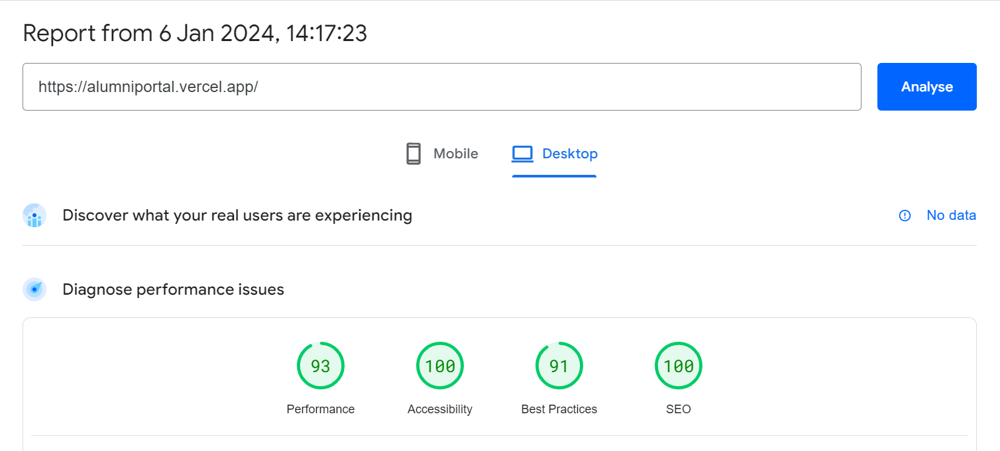

# Alumni Portal

The Alumni Portal allows alumni to connect with each other, stay up-to-date on school news, and find resources and opportunities.

Made with 💖 by [CS Club IIITDM](https://csclub.netlify.app/).

## Built with

- [NextJS](https://nextjs.org/)
- [Supabase](https://supabase.com)
- [Tailwind CSS](https://tailwindcss.com)
- [Vercel](https://vercel.com)

## Page Speed Insights report

## Data fetching

### `/` route

- Newsroom - data lives in newsroom table supabase - ISR
- Activities - data lives in newsroom table supabase - ISR
- Carousel - data lives in newsroom table supabase - ISR

### `/about` route

- data lives in `content/about.ts` file - SSG

### `/events` route

- data lives in activities table supabase - ISR

#### `/events/[id]` route

- data lives in activities table supabase - ISR

### `/gallery` route

- data lives in gallery table supabase - ISR

### `/newsroom`

- data lives in newsroom table supabase ISR

##### `/newsroom/[id]`

- data lives in newsroom table supabase ISR

### `/alumniDirectory`

- SSG

## Todo

- update team member details (images)
- moving deployment to cs club vercel account
- update search console
- link `alumniDirectory` to google sheets

## How to update team members data

- team member's data is present in [about.ts](content/about.ts) file.
- as it changes only once per academic year, it doesn't make any sense to store it in supabase.
- you will see a lot of variable exports.
- follow the schema and update them accordingly.
- image path can be a relative path to [this file](app/about/Team.tsx) or from supabase.

### Naming image files

- start with person's name followed by year, wing (alumni relations or event management or operations or public relations and marketing) which is followed by their position (refer to MemberData type in types.ts for more details). Also all these fields should be separated by `_` .
- for example image for Vibhavgopal from 2023, alumni relations lead should be `Vibhavgopal_2023_alumni_relations_lead.jpg/png` .
- I know it's too long for a file name but it is easier to maintain in the long run.
